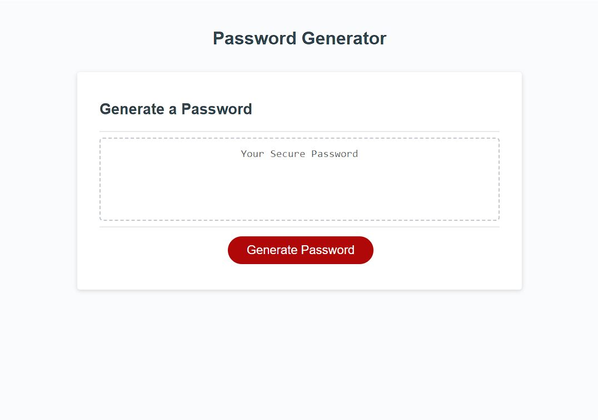

# random-password-generator-evank

## Description
This is a basic password generator that will create a random password based on user criteria. Webpage can be found at https://33649ek.github.io/random-password-generator-evank/.

## Usage
When the Generate Password button is clicked on, a series of prompts will pop up asking the user to select for various criteria. These criteria include password length and whether or not to include lowercase letters, uppercase letters, numbers, or special characters. If the password length that is chosen is less than 8 characters or more than 128 characters, the generator will stop and the process will have to start over, which can be initiated by pressing the Generate Password button for a subsequent time. If no character types are selected, the function will stop as well.

## Credits
Starter code taken from class repository.

## License
MIT License
